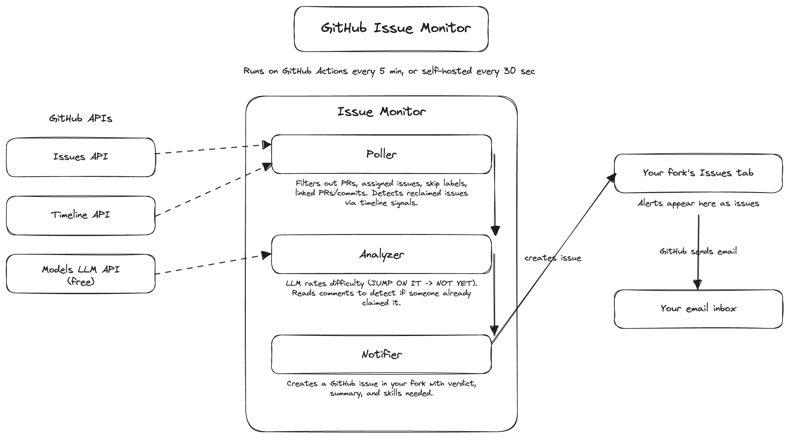

# GitHub Issue Monitor

An LLM-powered tool that assesses GitHub issues for newcomers who use Claude Code. The key question it answers: "could a newcomer with Claude Code realistically submit a PR for this?" Works in two modes:

- **Action mode** — A maintainer installs this once on a repo. When someone opens an issue, it instantly assesses it, adds the `good first issue` label, and posts a comment with the breakdown. Benefits the whole project — every contributor can see which issues are newcomer-friendly.
- **Polling mode** — Individual contributors fork this repo. It watches repos for new issues and emails you the newcomer-friendly ones before anyone else claims them.

Both modes use the same assessment engine: an LLM rates each issue on three axes — how clear the path to the fix is, how contained the scope is, and how much knowledge is needed beyond what Claude Code can figure out.

**They work well together.** Action mode labels issues so anyone browsing the repo can filter by `good first issue`. Polling mode emails you the moment one appears, so you never miss a good opportunity to contribute.

Each assessment includes:
- A plain English summary of what the issue is about
- What the fix likely involves (specific files/functions if mentioned)
- Skills needed that Claude Code can't provide
- A recommendation — "Go for it", "Worth trying if [condition]", or "Not recommended"
- A verdict — one of five levels:

| | Verdict | Score | Meaning |
|---|---|---|---|
| 🟢 | **JUMP ON IT** | 13-15 | The fix is spelled out. Anyone with Claude Code can do this. |
| 🔵 | **GO FOR IT** | 10-12 | Clear path, contained scope. Claude Code can handle the investigation. |
| 🟡 | **STRETCH** | 7-9 | Doable but needs some domain knowledge. Check the recommendation for what's needed. |
| 🟠 | **LONG SHOT** | 5-6 | Needs domain expertise Claude Code can't bridge. |
| 🔴 | **NOT YET** | 3-4 | Deep architectural knowledge required. Not for newcomers. |

Any axis scored at 1 (no starting point, architectural redesign, or deep project context needed) automatically caps the verdict at LONG SHOT regardless of the total score.

By default, only issues rated STRETCH or above get labeled/notified. You can adjust this with `MIN_VERDICT`.

---

## Action Mode — Install on any repo

Add this to a repo and every new issue gets assessed automatically. Newcomer-friendly issues get the `good first issue` label and a detailed comment.

### Setup

1. Add an `LLM_TOKEN` secret to the target repo (Settings → Secrets → Actions) — an API key for an OpenAI-compatible LLM endpoint (e.g. [GitHub Models](https://github.com/marketplace/models), OpenRouter, or any OpenAI-compatible provider)

2. Create `.github/workflows/newcomer-assess.yml` in the target repo:

```yaml
name: Assess newcomer-friendliness

on:
  issues:
    types: [opened]

permissions:
  issues: write

jobs:
  assess:
    runs-on: ubuntu-latest
    steps:
      - uses: gracesmith6504/github-issue-monitor@main
        with:
          github-token: ${{ secrets.GITHUB_TOKEN }}
          llm-token: ${{ secrets.LLM_TOKEN }}
```

That's it. When someone opens an issue, the action runs the LLM assessment and labels it if it's newcomer-friendly.

### Action inputs

| Input | Required | Default | Description |
|---|---|---|---|
| `github-token` | Yes | — | Token with `issues:write` permission |
| `llm-token` | Yes | — | API key for the LLM endpoint |
| `llm-endpoint` | No | GitHub Models | OpenAI-compatible API endpoint URL |
| `llm-model` | No | `gpt-4o` | LLM model to use |
| `min-verdict` | No | `STRETCH` | Minimum verdict to apply the label |
| `repo-profile` | No | — | Repo profile for calibrated assessment (e.g. `openshell`) |

### Action outputs

| Output | Description |
|---|---|
| `verdict` | The verdict string (e.g. `GO FOR IT`) |
| `summary` | One-line summary of the assessment |
| `label` | The label that was applied (if any) |

---

## Polling Mode — Personal issue notifications

Fork this repo and it watches repos for new issues, emails you the newcomer-friendly ones.

This is what the email looks like:


It also watches for **reclaimed issues** — previously claimed but then abandoned (detected via unassignment, closed PRs without merge, or removed work-in-progress labels). These show up with `[RECLAIMED]` in the subject line.

### Quick Setup — 2 minutes

No server, no terminal, no installs. GitHub runs it on its own servers every 30 minutes — even when your laptop is off.

#### 1. Fork this repo

Click the **Fork** button at the top of this page. Make sure to tick **Copy the main branch only**.

#### 2. Set which repos to watch

1. In your fork: **Settings** → **Secrets and variables** → **Actions** → **Variables** tab → **New repository variable**
2. Name: `WATCH_REPOS`, Value: everything after `github.com/` in the repo URL — for example:
   - `https://github.com/NVIDIA/OpenShell` → `NVIDIA/OpenShell`
   - `https://github.com/kagenti/kagenti-operator` → `kagenti/kagenti-operator`
   - Multiple repos: `NVIDIA/OpenShell,kagenti/kagenti-operator`

> **Important:** This goes under the **Variables** tab, not Secrets — they're on the same page but different tabs. If you add it as a Secret it will silently not work.

#### 3. Enable the workflow

1. In your fork, go to the **Actions** tab → click **I understand my workflows, go ahead and enable them**
2. Click **Issue Monitor** in the sidebar → **Enable workflow**

#### 4. Subscribe to email notifications

1. Go to your fork's main page
2. Click **Watch** (top right) → **All Activity** → **Apply**

That's it. Every 30 minutes GitHub checks your watched repos, analyzes new issues with an LLM, and creates a notification issue in your fork's Issues tab. You get an email because `github-actions[bot]` opens the issue, not you.

> **Nothing showing up?** The repo you're watching might just not have had a new issue in the last 30 minutes — that's normal. You can also add busier repos like `golang/go` or `kubernetes/kubernetes` to `WATCH_REPOS` to see a notification faster. Issues that are already assigned, have linked open PRs or commits, have recent fork activity (someone is likely working on a fix before opening a PR), have been claimed in comments, carry skip labels (spike, refactor, etc.), or that the LLM rates below your MIN_VERDICT threshold are silently skipped.

> **Want fewer notifications?** Add a `MIN_VERDICT` variable (same place as `WATCH_REPOS`) set to `GO FOR IT` or `JUMP ON IT`. You'll only get issues at that level or easier. Default is `STRETCH`.

> **Watching a private repo?** Add a `MONITOR_TOKEN` secret with a GitHub PAT (classic, `repo` scope) so the monitor can access it.

### Advanced Setup — 30+ minutes (self-hosted, polls every 30 sec)

Most users don't need this — Quick Setup is enough. Use this if you want to poll every 30 seconds instead of every 30 minutes, or if you want to run on your own cluster instead of relying on GitHub Actions.

Run the Python app yourself. Polls every 30 seconds. Can be deployed on OpenShift/Kubernetes.

This requires a **GitHub App** so the bot has its own identity (otherwise GitHub won't email you about issues you created yourself).

#### Step 1: Clone and install

```bash
git clone https://github.com/YOUR-USERNAME/github-issue-monitor.git
cd github-issue-monitor
pip install -r requirements.txt
```

#### Step 2: Create a GitHub token

1. Go to [github.com/settings/tokens](https://github.com/settings/tokens) → **Generate new token (classic)**
2. Name it `issue-monitor`, tick **`repo`**, click **Generate token**, copy it

#### Step 3: Create a notification repo

A private repo where the bot posts notifications.

1. Go to [github.com/new](https://github.com/new), name it `my-issue-alerts`, set to **Private**, create it
2. Go to the repo → **Watch** → **Custom** → tick **Issues** → **Apply**

#### Step 4: Create a GitHub App

1. Go to [github.com/settings/apps/new](https://github.com/settings/apps/new)
2. **Name:** `issue-monitor-bot-YOURNAME` (must be globally unique)
3. **Homepage URL:** `https://github.com/YOUR-USERNAME/github-issue-monitor`
4. **Webhook:** uncheck "Active"
5. **Permissions** → **Repository permissions** → **Issues:** Read and write
6. Click **Create GitHub App**, note the **App ID**
7. Scroll down → **Generate a private key** (downloads a `.pem` file)

#### Step 5: Install the app on your notification repo

1. In your app's settings → **Install App** → **Install** on your account
2. Select **Only select repositories** → pick your notification repo → **Install**
3. Note the **Installation ID** from the URL: `https://github.com/settings/installations/XXXXX`

#### Step 6: Run it

```bash
export MONITOR_TOKEN="ghp_your_token"
export WATCH_REPOS="NVIDIA/OpenShell"
export NOTIFY_REPO="your-username/my-issue-alerts"
export GITHUB_APP_ID="your_app_id"
export GITHUB_APP_INSTALLATION_ID="your_installation_id"
export GITHUB_APP_PRIVATE_KEY_PATH="/path/to/your-key.pem"

# Optional: set a separate LLM API key (defaults to MONITOR_TOKEN, which
# works for GitHub Models but not for OpenAI, OpenRouter, etc.)
# export LLM_TOKEN="sk-your_llm_key"
# export LLM_ENDPOINT="https://api.openai.com/v1"

python -m app.main
```

Press **Ctrl+C** to stop.

#### Step 7 (Optional): Run 24/7 on OpenShift/Kubernetes

```bash
podman build -t quay.io/your-username/github-issue-monitor:latest .
podman push quay.io/your-username/github-issue-monitor:latest

oc new-project issue-monitor
oc create secret generic issue-monitor-secret \
  --from-literal=MONITOR_TOKEN=ghp_... \
  --from-literal=WATCH_REPOS=NVIDIA/OpenShell \
  --from-literal=NOTIFY_REPO=your-username/my-issue-alerts \
  --from-literal=GITHUB_APP_ID=... \
  --from-literal=GITHUB_APP_INSTALLATION_ID=... \
  --from-file=GITHUB_APP_PRIVATE_KEY=/path/to/key.pem

oc run issue-monitor \
  --image=quay.io/your-username/github-issue-monitor:latest \
  --env-from=secret/issue-monitor-secret \
  --restart=Always
```

---

## Architecture



## Development

```bash
git clone https://github.com/YOUR-USERNAME/github-issue-monitor.git
cd github-issue-monitor
pip install -r requirements-dev.txt
python -m pytest tests/ -v
```

## How It Works

1. **Assessment engine** — sends the issue title, body, labels, and comments to an LLM (any OpenAI-compatible endpoint — GitHub Models, OpenRouter, etc.) which rates it on three axes: Starting Point (how clear is the path to the fix?), Scope (how contained?), and Familiarity (how much knowledge beyond what Claude Code can figure out?). Scores are 1-5 each, summed for the verdict.
2. **Repo profiles** — optional YAML profiles (`profiles/`) provide repo-specific calibration: architecture guides, domain complexity notes, and scored examples the LLM uses as anchors. Without a profile, the base prompt still produces reasonable results.
3. **Label signals** — `good first issue` and similar labels are passed as hints to the LLM for stronger signal
4. **Claimed detection** — deterministic checks for assignment, linked PRs, fork activity, and comment patterns ("I'll work on this"), plus an LLM second pass for unusual wordings
5. **Action mode** adds the `good first issue` label and posts a detailed assessment comment directly on the issue
6. **Polling mode** creates a notification issue in your fork (GitHub emails you), with skip labels and reclaimed issue detection

## Costs

**Free.** GitHub API and GitHub Actions are free for public repos. The LLM endpoint is configurable — GitHub Models and OpenRouter both offer free tiers. If you watch many busy repos you may hit rate limits, but for a handful of repos it's not an issue.

## Troubleshooting

| Problem | Fix |
|---|---|
| `ERROR: MONITOR_TOKEN environment variable is required` | Only applies to Advanced Setup — check your secret is named `MONITOR_TOKEN` exactly. Quick Setup users should never see this. |
| `ERROR: WATCH_REPOS environment variable is required` | You added `WATCH_REPOS` as a Secret instead of a Variable — go back and add it under the **Variables** tab |
| `Failed to create notification: 403` | GitHub App isn't installed on the notification repo (Advanced Setup only) |
| `LLM analysis failed` | Your LLM endpoint might be down or rate-limited — wait and retry |
| Not getting emails | Watch the repo with **All Activity** (not Custom). Check the notification issue shows `github-actions[bot]` as the author, not your username. |
| Actions workflow not running | Go to Actions tab and enable it |
| No notifications appearing | The watched repo might just not have had new issues — try adding a busier repo to WATCH_REPOS |

## License

MIT
