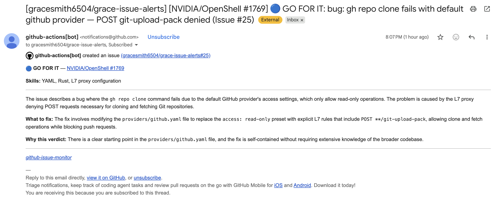

# GitHub Issue Monitor

A bot that emails you newcomer-friendly open source issues before they get claimed.

**The problem:** Contributing to open source is hard when you're new. Most issues are too complex, and the ones you could actually do get claimed quickly before you even see them.

**The solution:** Fork this repo, tell it which repos to watch, and it emails you every time a suitable issue appears — rated by an LLM so you only see the ones worth attempting.

This is what the email looks like:



It also watches for **reclaimed issues** — previously assigned but then abandoned. These show up with `[RECLAIMED]` in the subject line.

Each notification tells you:
- A plain English summary of what the issue is about
- What the fix likely involves (specific files/functions if mentioned)
- What skills you'd need
- A verdict — one of five levels:

| | Verdict | Meaning |
|---|---|---|
| 🟢 | **JUMP ON IT** | Clear starting point, straightforward fix. Claim it before someone else does. |
| 🔵 | **GO FOR IT** | Clear starting point, harder fix — Claude Code can guide you through it. |
| 🟡 | **STRETCH** | Vague starting point but enough context to investigate with Claude. Worth attempting. |
| 🟠 | **LONG SHOT** | Very little direction. Real risk of getting stuck. Only if you're feeling adventurous. |
| 🔴 | **NOT YET** | No clear entry point. Needs deep architectural knowledge. Skip this one. |

You get notified on JUMP ON IT, GO FOR IT, and STRETCH. LONG SHOT and NOT YET are silently skipped.

Works on any public repo. No webhooks needed. Completely free.

---

## Quick Setup — 2 minutes

No server, no terminal, no installs. GitHub runs it for you every 5 minutes and emails you when it finds something.

### 1. Fork this repo

Click the **Fork** button at the top of this page. Make sure to tick **Copy the main branch only**.

### 2. Add your GitHub token

1. Go to [github.com/settings/tokens](https://github.com/settings/tokens) → **Generate new token (classic)**
2. Give it a name, tick **`repo`**, click **Generate token**, copy it
3. In your fork: **Settings** → **Secrets and variables** → **Actions** → **New repository secret**
4. Name: `MONITOR_TOKEN`, Value: paste your token → **Add secret**

### 3. Set which repos to watch

1. In your fork: **Settings** → **Secrets and variables** → **Actions** → **Variables** tab → **New repository variable**
2. Name: `WATCH_REPOS`, Value: `NVIDIA/OpenShell` (or any repos, comma-separated)

> **Important:** This goes under the **Variables** tab, not Secrets — they're on the same page but different tabs. If you add it as a Secret it will silently not work.

### 4. Enable the workflow

1. In your fork, go to the **Actions** tab → click **I understand my workflows, go ahead and enable them**
2. Click **Issue Monitor** in the sidebar → **Enable workflow**

### 5. Subscribe to email notifications

1. Go to your fork's main page
2. Click **Watch** (top right) → **All Activity** → **Apply**

That's it. Every 5 minutes GitHub checks your watched repos, analyzes new issues with an LLM, and creates a notification issue in your fork's Issues tab. You get an email because `github-actions[bot]` opens the issue, not you.

> **Nothing showing up?** The repo you're watching might just not have had a new issue in the last 5 minutes — that's normal. You can also add busier repos like `golang/go` or `kubernetes/kubernetes` to `WATCH_REPOS` to see a notification faster. Issues that are already assigned or that the LLM rates as NOT YET or LONG SHOT are silently skipped.

---

## Advanced Setup — 30+ minutes (self-hosted, polls every 30 sec)

Most users don't need this — Quick Setup is enough. This is for faster detection or running 24/7 on a cluster.

For faster detection, run the Python app yourself. Polls every 30 seconds. Can be deployed on OpenShift/Kubernetes to run 24/7.

This requires a **GitHub App** so the bot has its own identity (otherwise GitHub won't email you about issues you created yourself).

### Step 1: Clone and install

```bash
git clone https://github.com/YOUR-USERNAME/github-issue-monitor.git
cd github-issue-monitor
pip install -r requirements.txt
```

### Step 2: Create a GitHub token

1. Go to [github.com/settings/tokens](https://github.com/settings/tokens) → **Generate new token (classic)**
2. Name it `issue-monitor`, tick **`repo`**, click **Generate token**, copy it

### Step 3: Create a notification repo

A private repo where the bot posts notifications.

1. Go to [github.com/new](https://github.com/new), name it `my-issue-alerts`, set to **Private**, create it
2. Go to the repo → **Watch** → **Custom** → tick **Issues** → **Apply**

### Step 4: Create a GitHub App

1. Go to [github.com/settings/apps/new](https://github.com/settings/apps/new)
2. **Name:** `issue-monitor-bot-YOURNAME` (must be globally unique)
3. **Homepage URL:** `https://github.com/YOUR-USERNAME/github-issue-monitor`
4. **Webhook:** uncheck "Active"
5. **Permissions** → **Repository permissions** → **Issues:** Read and write
6. Click **Create GitHub App**, note the **App ID**
7. Scroll down → **Generate a private key** (downloads a `.pem` file)

### Step 5: Install the app on your notification repo

1. In your app's settings → **Install App** → **Install** on your account
2. Select **Only select repositories** → pick your notification repo → **Install**
3. Note the **Installation ID** from the URL: `https://github.com/settings/installations/XXXXX`

### Step 6: Run it

```bash
export MONITOR_TOKEN="ghp_your_token"
export WATCH_REPOS="NVIDIA/OpenShell"
export NOTIFY_REPO="your-username/my-issue-alerts"
export GITHUB_APP_ID="your_app_id"
export GITHUB_APP_INSTALLATION_ID="your_installation_id"
export GITHUB_APP_PRIVATE_KEY_PATH="/path/to/your-key.pem"

python -m app.main
```

Press **Ctrl+C** to stop.

### Step 7 (Optional): Run 24/7 on OpenShift/Kubernetes

```bash
podman build -t quay.io/your-username/github-issue-monitor:latest .
podman push quay.io/your-username/github-issue-monitor:latest

oc new-project issue-monitor
oc create secret generic issue-monitor-secret \
  --from-literal=MONITOR_TOKEN=ghp_... \
  --from-literal=WATCH_REPOS=NVIDIA/OpenShell \
  --from-literal=NOTIFY_REPO=your-username/my-issue-alerts \
  --from-literal=GITHUB_APP_ID=... \
  --from-literal=GITHUB_APP_INSTALLATION_ID=... \
  --from-file=GITHUB_APP_PRIVATE_KEY=/path/to/key.pem

oc run issue-monitor \
  --image=quay.io/your-username/github-issue-monitor:latest \
  --env-from=secret/issue-monitor-secret \
  --restart=Always
```

---

## How It Works

1. Polls the GitHub Issues API for each repo you're watching, using a persistent `since` timestamp to track what's already been seen
2. Filters out pull requests, assigned issues, and anything the LLM rates as LONG SHOT or NOT YET
3. Catches two kinds of opportunity: new unassigned issues, and reclaimed issues (previously assigned, now abandoned)
4. Checks labels — `good first issue` is an instant strong signal
5. Sends the issue to an LLM (GitHub Models, free) which rates it on how approachable it is for a newcomer
6. Creates a notification issue in your fork — GitHub emails you because the bot opens it, not you

## Costs

**Free.** GitHub API, GitHub Models LLM, and GitHub Actions are all free for public repos.

## Troubleshooting

| Problem | Fix |
|---|---|
| `ERROR: MONITOR_TOKEN environment variable is required` | Check your secret is named `MONITOR_TOKEN` exactly |
| `ERROR: WATCH_REPOS environment variable is required` | You added `WATCH_REPOS` as a Secret instead of a Variable — go back and add it under the **Variables** tab |
| `Failed to create notification: 403` | GitHub App isn't installed on the notification repo (Advanced Setup only) |
| `LLM analysis failed` | GitHub Models might be down — wait and retry |
| Not getting emails | Watch the repo with **All Activity** (not Custom). Check the notification issue shows `github-actions[bot]` as the author, not your username. |
| Actions workflow not running | Go to Actions tab and enable it |
| No notifications appearing | OpenShell might just not have had new issues — try adding a busier repo to WATCH_REPOS |

## License

MIT
